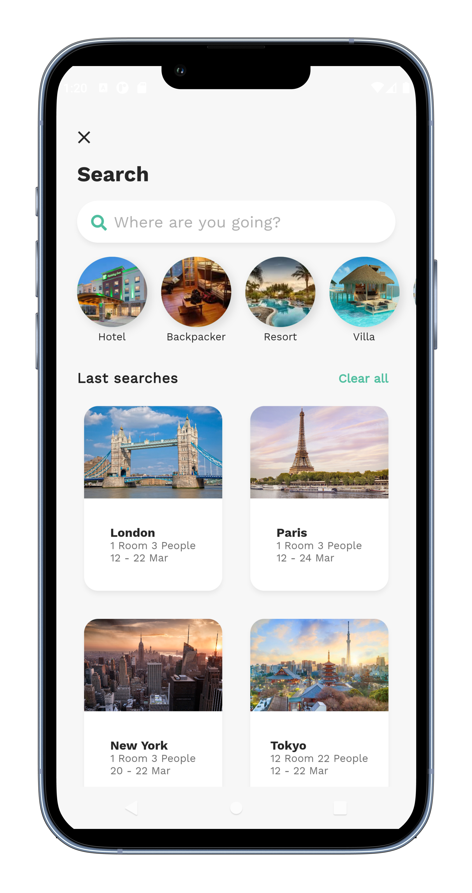
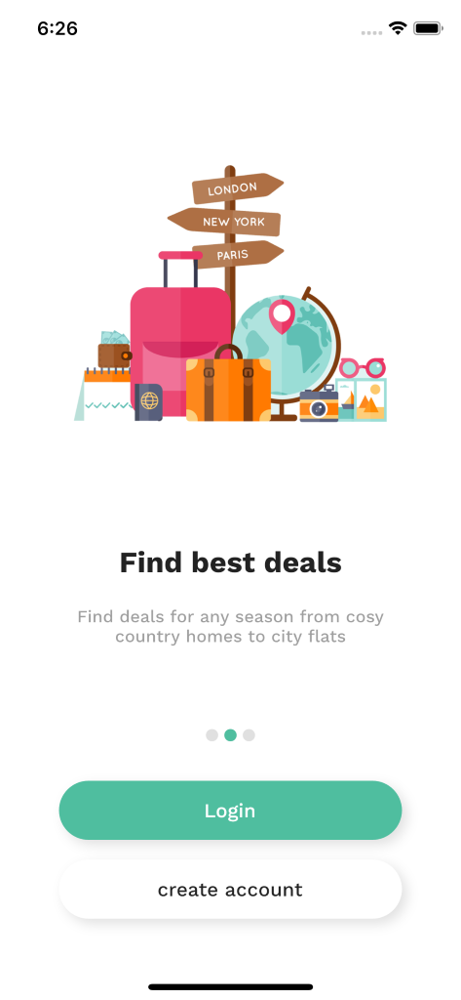
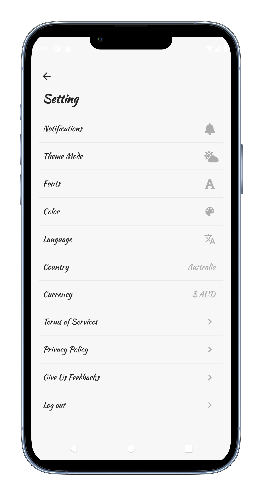

# Flutter_hotel_booking_ui

In this video, I'm going to show you how to make a Cool Hotel Booking App using Flutter from scratch.

In this Episode , you will learn how to create a Custom Animated Hotel Explorer and Room Booking Screen to view the list of Hotels near by.

🚀 Nice, clean and modern Hotel Booking #App #UI made in #Flutter

## [Watch it on YouTube](https://youtu.be/PV5GV9m0HvY)
   
**Packages we are using:**

-   smooth_page_indicator: [link](https://pub.dev/packages/smooth_page_indicator)
-   provider: [link](https://pub.dev/packages/provider)
-   font_awesome_flutter: [link](https://pub.dev/packages/font_awesome_flutter)
-   google_fonts: [link](https://pub.dev/packages/google_fonts)
-   shared_preferences: [link](https://pub.dev/packages/shared_preferences)
-   font_awesome_flutter [link](https://pub.dev/packages/font_awesome_flutter)
-   google_maps_flutter [link](https://pub.dev/packages/google_maps_flutter)
-   flutter_rating_bar [link](https://pub.dev/packages/flutter_rating_bar)

## Screens it contains:

=> Explorer Screen

Now it contains all the screen, thanks for your love and support 🙏 

## Photos

