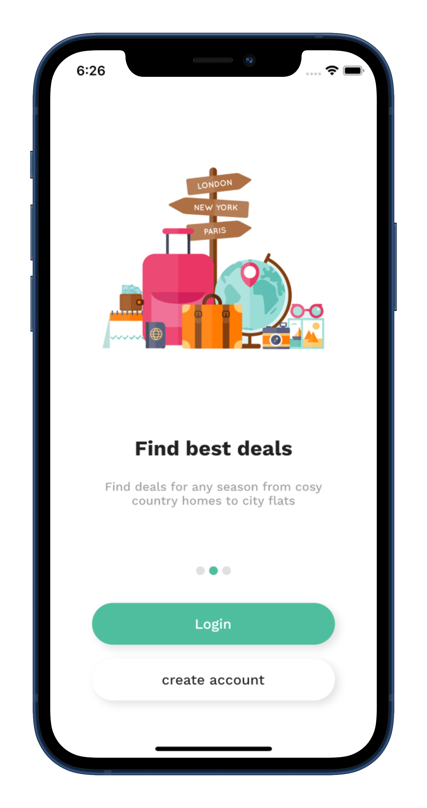

# Flutter_hotel_booking_ui

A new Flutter project.In this video, I'm going to show you how to make a Cool Hotel Booking App using Flutter and visual studio code from scratch. 
In this tutorial, you will learn how to create a Splash Screen and Introduction Screen, how to implement a SmoothPageIndicator in Flutter.

## [Watch it on YouTube](https://youtu.be/-tHUmjIkGJ4)

   
**Packages we are using:**

-   smooth_page_indicator: [link](https://pub.dev/packages/smooth_page_indicator)
-   provider: [link](https://pub.dev/packages/provider)
-   font_awesome_flutter: [link](https://pub.dev/packages/font_awesome_flutter)
-   google_fonts: [link](https://pub.dev/packages/google_fonts)
-   shared_preferences: [link](https://pub.dev/packages/shared_preferences)

## Screens it contains:

=> Splash Screen

=> Introduction Screen

Now it contains all the screen, thanks for your love and support 🙏 

## Photos

